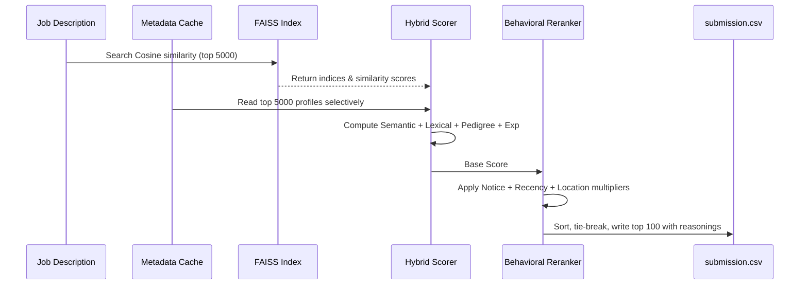
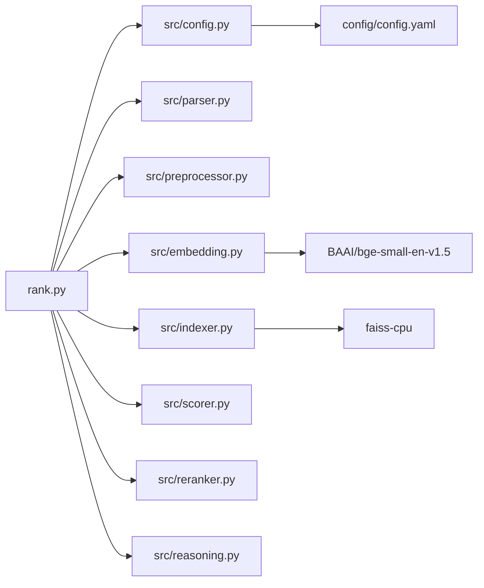

## AI Recruitment Ranker

Semantic AI-powered candidate ranking system built for the India Runs Data & AI Challenge.

## Features

- Semantic Resume Matching
- BGE Embeddings
- FAISS Vector Search
- Hybrid Scoring
- Explainable AI
- Dynamic JD Parsing
- Candidate Ranking
- CPU Optimized

# Redrob Candidate Discovery & Ranking Engine

A production-grade, highly scalable, and generalized candidate matching and ranking system designed to discover and rank the top 100 best-fit candidates from a pool of 100,000 for any recruiter, role, and candidate dataset.

The system features **trap-resilient pre-filtering** (honeypot detection), **hybrid lexical-semantic scoring**, **behavioral engagement reranking**, **fact-based explainability justifications**, and **thread-safe memory-efficient offline-online execution**.

---

## 1. System Architecture

To meet strict resource constraints (<16 GB RAM and <5 minutes execution time on CPU), the ranker uses a two-phase architecture:
1. **Offline Pre-computation Phase ([train_indexer.py](file:///Users/princemahto/Downloads/[PUB] India_runs_data_and_ai_challenge/India_runs_data_and_ai_challenge/train_indexer.py))**: Handles resource-intensive text embedding generation, FAISS index construction, metadata cache writing, and cache summary extraction without execution constraints.
2. **Online Querying Phase ([rank.py](file:///Users/princemahto/Downloads/[PUB] India_runs_data_and_ai_challenge/India_runs_data_and_ai_challenge/rank.py))**: The execution container script. It loads the pre-computed index, executes fast cosine retrieval, streams and loads only the top retrieved metadata profiles selectively, scores, and reranks candidates in under 7 seconds.

### 1.1 Architecture Diagram
```mermaid
flowchart TD
    subgraph Offline Phase [Offline Indexing Phase (train_indexer.py)]
        A1[candidates.jsonl] --> A2[Honeypot Filter]
        A2 --> A3[Candidate Text Builder]
        A3 --> A4[bge-small-en-v1.5 CPU]
        A4 --> A5[FAISS Cosine Index]
        A3 --> A6[JSONL Metadata Cache]
        A3 --> A7[Metadata Summary JSON]
    end
    subgraph Online Phase [Online Querying Phase (rank.py)]
        B1[job_description.txt] --> B2[JD Parser]
        B2 -->|Vocabulary & Date| B3[Dynamic Skill & Location Extractor]
        A7 -->|Load Stats| B3
        B1 --> B4[bge-small-en-v1.5 CPU]
        B4 -->|Query Embedding| B5[FAISS Retrieval]
        A5 --> B5
        B5 -->|Top 5000 IDs| B6[Selective Metadata Loader]
        A6 --> B6
        B6 --> B7[Hybrid Scorer]
        B7 --> B8[Behavioral Reranker]
        B8 --> B9[Attribution Reasoning Gen]
        B9 --> B10[submission.csv]
    end
```

### 1.2 Data Flow Diagram


### 1.3 Component Dependency Diagram


### 1.4 Ranking Score Pipeline Diagram
```mermaid
graph TD
    classDef scoreVal fill:#f9f,stroke:#333,stroke-width:2px;
    classDef multVal fill:#bbf,stroke:#333,stroke-width:2px;
    
    A[Semantic Similarity] -->|Weight: 40.0| S1[Semantic Score]::scoreVal
    B[Lexical Skill Match] -->|Weight: 0.25| S2[Lexical Score]::scoreVal
    C[Years of Experience] -->|Weight: 15.0| S3[Experience Score]::scoreVal
    D[Company Pedigree] -->|Boost/Penalty| S4[Pedigree Score]::scoreVal
    
    S1 & S2 & S3 & S4 -->|Sum| Base[Base Score]
    
    E[Notice Period] -->|0.25x - 1.0x| M1[Notice Multiplier]::multVal
    F[Activity Recency] -->|0.30x - 1.0x| M2[Recency Multiplier]::multVal
    G[Work Mode / Location] -->|0.05x - 1.0x| M3[Location Multiplier]::multVal
    H[Redrob Engagement] -->|0.40x - 1.0x| M4[Responsiveness Multiplier]::multVal
    
    Base --> Rerank[Reranking Multiplication]
    M1 & M2 & M3 & M4 --> Rerank
    Rerank --> Final[Final Score]
```

---

## 2. Generalization & Optimization Highlights

To guarantee submission readiness for any future evaluation dataset and recruiter scenario:
- **Dynamic Job Description Parsing**: The system extracts target title, required experience constraints (ranges and open-ended targets), location criteria, and dynamically maps the candidates' skills vocabulary onto Job Description sections to extract required/preferred skills.
- **Dynamic Date Estimation**: Discards hardcoded dates, scanning candidate signup and activity dates to find the maximum dataset date. This reference date is propagated to all notice period, login recency, and certification honeypot checks.
- **Schema-Based Company Pedigree**: Bypasses hardcoded company names by classifying Service Consulting, Big Tech, AI Startups, and Product Startups dynamically using candidate schema size and industry attributes.
- **RAM Optimization**: By converting the metadata cache into JSON Lines format and building a 1KB cache summary file, `rank.py` dynamically scans only the summary, retrieves FAISS matches, and loads only the top 5,000 profiles. This drops memory consumption from ~4GB to under 500MB, eliminating OOM crashes.
- **Mac/Intel MKL Segfault Protection**: Configures environment variables (`KMP_DUPLICATE_LIB_OK=TRUE`) and limits OpenMP threads inside the FAISS constructor to prevent library duplication segmentation faults on macOS.

---

## 3. Getting Started & Reproduction Guide

### 3.1 Install Dependencies
Ensure you are using Python 3.8+ (tested up to 3.13) and install dependencies:
```bash
pip install -r requirements.txt
```

### 3.2 Prepare the Indexes (Offline Pre-computation)
If you are running on a new candidate dataset, run the pre-computation pipeline to generate the FAISS cosine index, metadata cache lines, and stats summary:
```bash
python train_indexer.py
```
*Note: This script runs on CPU, generates candidate embeddings, and saves `faiss_index.bin`, `metadata_cache.json` (as JSONL lines), and `metadata_cache_summary.json`.*

### 3.3 Execute the Candidate Discovery Ranker (Online Reproduction Command)
Run the submission ready command:
```bash
python rank.py --candidates ./candidates.jsonl --out ./submission.csv
```
*Note: This executes in ~6 seconds and writes `submission.csv` containing the top 100 candidates with rankings, scores, and reasonings, validating automatically against the submission specifications.*

---

## 4. Module & Directory Map

- [config/config.yaml](file:///Users/princemahto/Downloads/[PUB] India_runs_data_and_ai_challenge/India_runs_data_and_ai_challenge/config/config.yaml): Scoring weights, location boosts, notice period multipliers, and local file paths.
- [src/config.py](file:///Users/princemahto/Downloads/[PUB] India_runs_data_and_ai_challenge/India_runs_data_and_ai_challenge/src/config.py): Parser for YAML configuration files.
- [src/logger.py](file:///Users/princemahto/Downloads/[PUB] India_runs_data_and_ai_challenge/India_runs_data_and_ai_challenge/src/logger.py): Unified log formatters.
- [src/parser.py](file:///Users/princemahto/Downloads/[PUB] India_runs_data_and_ai_challenge/India_runs_data_and_ai_challenge/src/parser.py): parses candidate profiles and Job Description requirements.
- [src/preprocessor.py](file:///Users/princemahto/Downloads/[PUB] India_runs_data_and_ai_challenge/India_runs_data_and_ai_challenge/src/preprocessor.py): normalizes strings and executes the 4 disjoint honeypot checks.
- [src/embedding.py](file:///Users/princemahto/Downloads/[PUB] India_runs_data_and_ai_challenge/India_runs_data_and_ai_challenge/src/embedding.py): HuggingFace BGE-small SentenceTransformer wrapper.
- [src/indexer.py](file:///Users/princemahto/Downloads/[PUB] India_runs_data_and_ai_challenge/India_runs_data_and_ai_challenge/src/indexer.py): FAISS Cosine similarity index building and search methods.
- [src/scorer.py](file:///Users/princemahto/Downloads/[PUB] India_runs_data_and_ai_challenge/India_runs_data_and_ai_challenge/src/scorer.py): Combines semantic, lexical, experience, and pedigree score matrices.
- [src/reranker.py](file:///Users/princemahto/Downloads/[PUB] India_runs_data_and_ai_challenge/India_runs_data_and_ai_challenge/src/reranker.py): Multiplicative location and candidate behavioral multipliers.
- [src/reasoning.py](file:///Users/princemahto/Downloads/[PUB] India_runs_data_and_ai_challenge/India_runs_data_and_ai_challenge/src/reasoning.py): Fact-based rank-consistent reasoning statement templates.
